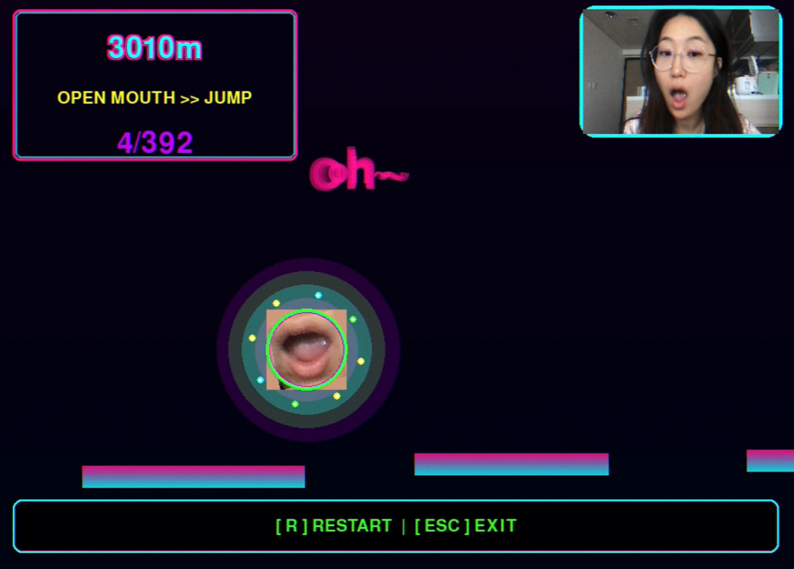
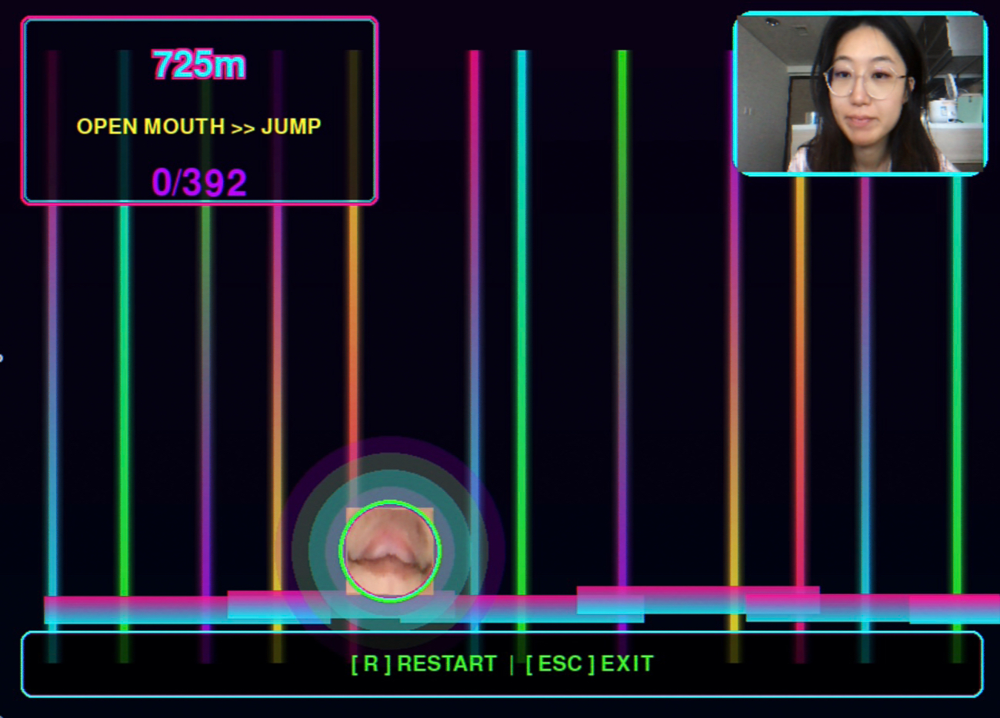

<<<<<<< HEAD
# oo_adventure - 音乐节奏跳跃游戏 🎵🌸
# Project Introduction
oo_adventure is a rhythm-based platformer game where you control the character by opening your mouth in front of a webcam. The background music is David Tao's "Find Yourself", and a bubble pop sound plays when you jump.

## Demo Video
[Watch gameplay demo on YouTube](https://youtu.be/DLdJlzucmjM)

# 游戏截图
## Screenshots



# 文件结构
# File Structure
```
oo_adventure/
├── game.py                  # Main game file (webcam mouth control, rhythm platformer)
├── find_yourself.mp3        # Background music (download, see below)
├── bubblepop-254773.mp3     # Jump sound effect (download, see below)
├── requirements.txt         # Python dependencies
├── install_requirements.sh  # One-click install script
└── README.md                # Project documentation
```

# 资源下载
# Resource Download
- David Tao "Find Yourself" MP3: [Google Drive Link](https://drive.google.com/file/d/1QlHNg6zMcciLXTHnjFBFHlAVqkRuMQY9/view?usp=drive_link)
  - After downloading, rename to `find_yourself.mp3` and place in the project root
- Jump sound effect MP3: [Google Drive Link](https://drive.google.com/file/d/10qPV0qKGVayyi0aazKi6OAu1jF7b_7cJ/view?usp=drive_link)
  - After downloading, rename to `bubblepop-254773.mp3` and place in the project root

# 安装与运行
# Installation & Run
1. Install dependencies
   - Recommended: `pip install -r requirements.txt`
   - Or run `./install_requirements.sh`
2. Make sure resource files are placed (see download section above)
3. Run the game
   ```bash
   python game.py
   ```

# 游戏玩法
# How to Play
- Face the webcam and open your mouth to jump
- Platforms are generated according to the music rhythm, gaps appear on beats
- Bubble pop sound plays when jumping
- UI shows distance, beat progress, and controls
- Press R to restart, ESC to exit

# 技术栈
# Tech Stack
- Python 3.8+
- Pygame
- OpenCV
- MediaPipe
- Librosa
- NumPy

# 依赖列表（requirements.txt）
# Dependencies (requirements.txt)
```
pygame>=2.5.0
opencv-python>=4.8.0
mediapipe>=0.10.0
numpy>=1.24.0
```

# 常见问题
# FAQ
- Webcam not working: Check permissions or device
- No music/sound: Make sure filenames and paths are correct
- Face detection not sensitive: Ensure good lighting, keep face centered

# 版权说明
# License
- Game code: MIT License
- Music copyright belongs to the original author, for learning and entertainment only
=======
# Flower Hop - 酸性设计美学节奏跳跃游戏

本项目是一个结合酸性设计美学、摄像头人脸识别、嘴巴控制跳跃与音乐节奏的平台跳跃游戏。玩法、视觉与交互均高度赛博朋克风格，适合展示 Pygame + OpenCV + MediaPipe + NumPy + Librosa 的多媒体能力。

## 玩法特色
- 酸性设计美学：高饱和霓虹色、金属质感、故障艺术、粒子特效
- 摄像头人脸识别：实时检测人脸与嘴巴，右上角显示摄像头画面
- 嘴巴控制跳跃：张嘴即可跳跃，闭嘴跳跃高度较低，滞空时间更短
- 音乐节奏平台生成：自动分析音乐节拍，平台随节奏生成，支持陶喆《找自己》或自定义 mp3
- 赛博朋克 UI：毛玻璃面板、霓虹边框、动态提示、节拍指示
- 粒子系统：跳跃/落地均有霓虹粒子爆炸

## 操作说明
- 张嘴：角色高跳
- 闭嘴：角色低跳
- [R]：重启游戏
- [ESC]：退出游戏

## 依赖安装
推荐使用虚拟环境：
```bash
python3 -m venv .venv
source .venv/bin/activate
pip install -r requirements.txt
```

## 文件说明
- `flower_hop_game.py`：主程序入口
- `find_yourself.mp3`：音乐文件（可选，建议使用陶喆《找自己》）
- `requirements.txt`：依赖列表
- `README.md`：项目说明

## 常见问题
- 音乐无法播放：请确保 mp3 文件存在且命名为 `find_yourself.mp3`
- 摄像头无法打开：请检查摄像头权限或驱动
- 人脸识别失败：请确保光线充足，摄像头无遮挡
- 依赖安装失败：请检查 Python 版本（建议 3.10+），并确保 pip 可用

## 路线图
- 酸性美学特效优化
- 支持更多音乐节奏分析
- 增加关卡与障碍物
- 多人对战/排行榜
- 移动端适配

## License
MIT
>>>>>>> 738652308d5cdd6b060d9d2712607c1574079f8b
